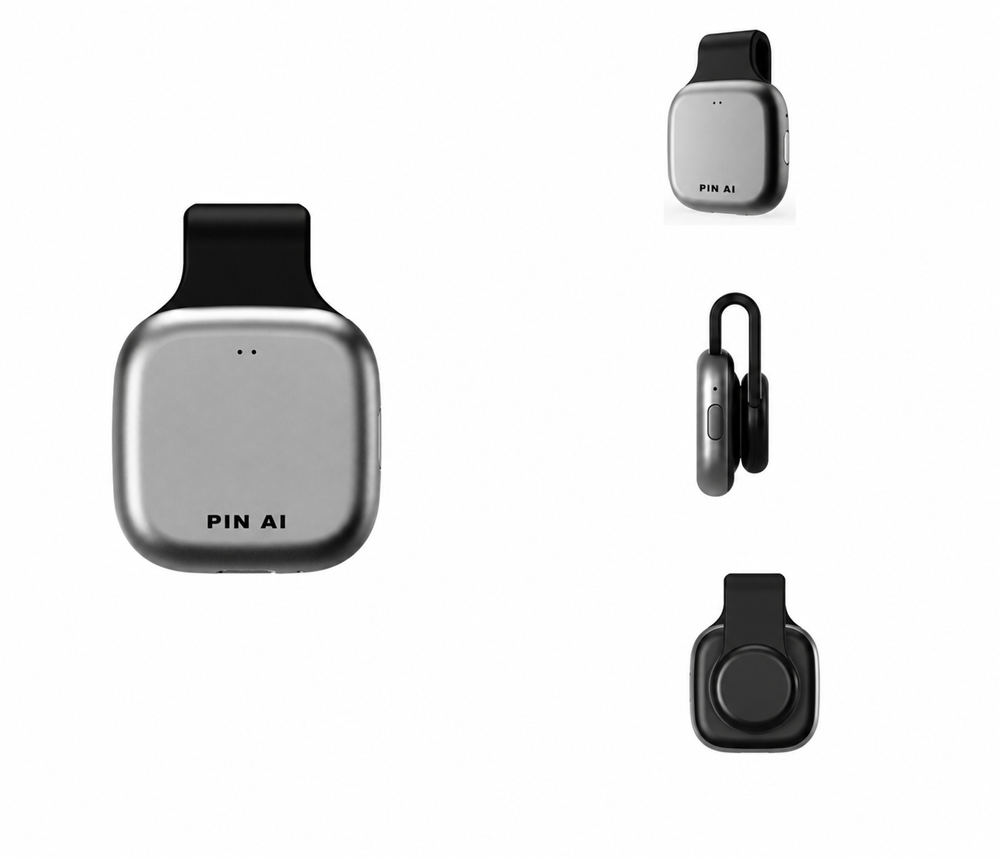

# Hi, I'm Smile Hu

Chief AI Engineer & Chief Researcher at [PIN AI](https://www.pinai.com/) [@PINAI_IO](https://x.com/PINAI_IO) | Ex-Zhipu AI [@Zai_org](https://x.com/Zai_org) | Ex-SAP [@SAP](https://x.com/SAP)

I am a senior AI engineer, full-stack engineer, and AI product manager focused on taking AI products from 0 to 1: product framing, research, agent harness design, backend/frontend/mobile/hardware implementation, evaluation, and launch.

My long-term focus is Personal AI, Ambient AI, Agent Harness, and practical AI products. I also turn product and engineering work into skills, articles, and open-source artifacts.

## PIN AI

- Chief AI Engineer & Chief Researcher at [PIN AI](https://www.pinai.com/), building Personal AI and agentic product systems.
- Built Personal AI / Ambient AI hardware prototypes and hardware-software product workflows during my work at PIN AI.

- Company milestone: [$10M funding announcement](https://x.com/pinai_io/status/1833176031714541651).
- Product milestone: [3M+ users announcement](https://x.com/pinai_io/status/1950915602983346431).
- Open source: [PIN-AI/pinai_agent_sdk](https://github.com/PIN-AI/pinai_agent_sdk).

## Open Source & Research

- [agent-chief](https://github.com/SmileLikeYe/agent-chief) - My open-source Agent Harness project for AI-native builders.
- [MTEB](https://github.com/embeddings-benchmark/mteb) - 2+ year contributor to the embedding benchmark ecosystem and leaderboard workflows.
- [PINAI Agent SDK](https://github.com/PIN-AI/pinai_agent_sdk) - SDK work around the PINAI agent ecosystem.

## Experience

- [Zhipu AI / Z.ai](https://bigmodel.cn/) - FDE work on model fine-tuning and customer co-creation.
- [SAP](https://www.sap.com/) - Full-stack and mobile engineering across web, backend, iOS, and Android.
- SAP mobile apps: [SAP Business One Sales](https://play.google.com/store/apps/details?id=b1.sales.mobile.android&hl=en_GB) and [SAP Business One Service](https://play.google.com/store/apps/details?id=b1.service.mobile.android).

## Stack

Agent Harness - Personal AI - Ambient AI - Ambient AI Hardware - Hardware-Software Integration - AI Agents - LLM Orchestration - Evaluation - TypeScript - React - Python - FastAPI - Swift - iOS - Android - PostgreSQL - Full-stack Product Engineering

## Contact

- Website: [smileflow.cn](https://smileflow.cn)
- X / Twitter: [@Yeshujing](https://x.com/Yeshujing)
- Email: [smiletoye@gmail.com](mailto:smiletoye@gmail.com)
